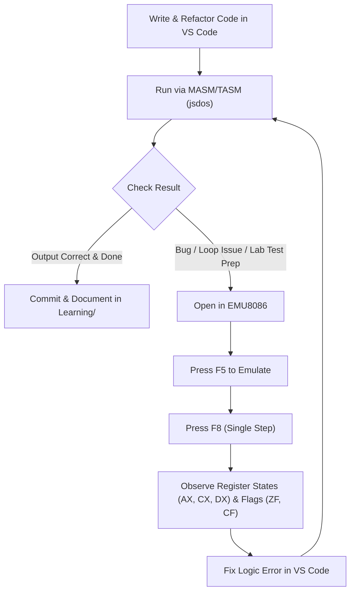

# 8086 Microprocessor & Assembly Lab: Environment Setup & Execution Guide

This repository contains lab experiments, assignments, and study materials for the **8086 Microprocessor & Assembly Language Lab**. This document provides the complete setup guide for editing, running, and debugging 8086 Assembly programs in both **Visual Studio Code** and **EMU8086 Microprocessor Emulator**.

---

## Table of Contents
1. [Toolchain Overview: VS Code vs. EMU8086](#1-toolchain-overview-vs-code-vs-emu8086)
2. [Method 1: Running Inside VS Code (Fast Coding & Instant Execution)](#2-method-1-running-inside-vs-code-fast-coding--instant-execution)
   - [Step 1: Install MASM/TASM Extension](#step-1-install-masmtasm-extension)
   - [Step 2: Configure Built-in Emulator to `jsdos` (Instant Fix)](#step-2-configure-built-in-emulator-to-jsdos-instant-fix)
   - [Step 3: Syntax Highlighting Extension](#step-3-syntax-highlighting-extension)
   - [Step 4: Running Your Code](#step-4-running-your-code)
3. [Method 2: EMU8086 (The Gold Standard for Register & Flag Tracing)](#3-method-2-emu8086-the-gold-standard-for-register--flag-tracing)
   - [Why EMU8086 is Recommended for Lab Work & Exams](#why-emu8086-is-recommended-for-lab-work--exams)
   - [Installing & Launching EMU8086](#installing--launching-emu8086)
   - [How to Single-Step and Trace Registers](#how-to-single-step-and-trace-registers)
   - [Viewing Memory, Flags, and Stack](#viewing-memory-flags-and-stack)
4. [Method 3: Standalone DOSBox with TASM & Turbo Debugger (TD)](#4-method-3-standalone-dosbox-with-tasm--turbo-debugger-td)
5. [Recommended Hybrid Workflow](#5-recommended-hybrid-workflow)
6. [Troubleshooting & Common Pitfalls](#6-troubleshooting--common-pitfalls)
7. [Conceptual Notes, High-Level Mappings & Must-Knows (`doc/note/`)](#7-conceptual-notes-high-level-mappings--must-knows-docnote)

---

## 1. Toolchain Overview: VS Code vs. EMU8086

Because 8086 Assembly produces **16-bit real-mode DOS executables**, modern 64-bit Windows cannot execute them natively without an emulator.

| Feature | VS Code (`MASM/TASM` + `jsdos`) | EMU8086 (Lab Standard) | Standalone DOSBox + Turbo Debugger (`TD`) |
| :--- | :--- | :--- | :--- |
| **Primary Purpose** | Fast editing, modern IDE features, instant compilation & execution | Interactive learning, visual register/flag tracing, academic standard | Authentic command-line DOS environment, advanced breakpoint debugging |
| **Setup Difficulty** | Very Easy (1 extension install) | Easy (Standalone installer) | Moderate (Requires mounting paths & DOS commands) |
| **Editor Features** | Full VS Code (Snippets, themes, git, autocomplete) | Basic classic editor | Command-line only / DOS-based IDE |
| **Register / Flag Display** | ❌ None (Shows console output only) | ✅ **Full Real-Time Visual GUI** (`AX`, `BX`, `CX`, `DX`, `FLAGS`, `IP`, `SP`) | ✅ Text-mode GUI (`TD.EXE`) |
| **Single-Step Debugging** | ⚠️ Limited / Complicated | ✅ **1-Click Step Button (`F8`)** | ✅ Step into (`F7`) / Step over (`F8`) |
| **Memory & Stack Inspection** | ❌ Difficult | ✅ **Live Memory & Stack Visualizers** | ✅ CPU dump window |
| **Recommended Use Case** | Writing, organizing, and quickly batch-running lab codes | **Exam preparation, tracing loops, arithmetic analysis, debugging faults** | Emulating real legacy hardware environments |

---

## 2. Method 1: Running Inside VS Code (Fast Coding & Instant Execution)

Use VS Code when writing code, committing to GitHub, or wanting rapid edit-and-run cycles without switching applications.

### Step 1: Install MASM/TASM Extension
1. Open VS Code.
2. Open the Extensions sidebar (`Ctrl + Shift + X`).
3. Search for **`MASM/TASM`** by author **dosasm** (Extension ID: `dosasm.masm-tasm`).
4. Click **Install**.

### Step 2: Configure Built-in Emulator to `jsdos` (Instant Fix)
By default, the extension tries to launch external `dosbox`. If DOSBox is not installed on Windows or not in System `PATH`, it fails with:
`can't open dosbox with command: dosbox -conf ... cwd:undefined`

To fix this instantly without installing any external software:
1. Open VS Code Settings (`Ctrl + ,`).
2. In the search bar, type: **`masm-tasm.emulator`**
3. Change the dropdown selection from `dosbox` to **`jsdos`**.
4. *(Optional)* Search for `masm-tasm.assembler` and choose **`TASM`** or **`MASM-v6.11`** according to your lab curriculum.

> [!TIP]
> `jsdos` runs a high-performance WebAssembly DOS emulator directly inside a VS Code tab. It requires zero configuration, mounts your workspace automatically, and compiles on the fly.

### Step 3: Syntax Highlighting Extension
For clean syntax coloring, operand highlighting, and register coloring, install:
- **`x86 and x86_64 Assembly`** (by *13xforever*)

### Step 4: Running Your Code
1. Open any `.asm` file (e.g. [`LabCodes/lab-7/7.1_loop.asm`](file:///LabCodes/lab-7/7.1_loop.asm)).
2. Right-click inside the code editor.
3. Select **Run ASM code** (or press `Shift + Alt + R`).
4. A new tab titled **`JSDOS: ...`** will open inside VS Code, assemble, link, and display the output directly.

---

## 3. Method 2: EMU8086 (The Gold Standard for Register & Flag Tracing)

While VS Code is superior for typing code, **EMU8086 is the academic gold standard** because it provides a visual microcomputer simulation. 

### Why EMU8086 is Recommended for Lab Work & Exams
In microprocessor lab exams and viva voce:
- You must demonstrate what values are stored in `AH`, `AL`, `BH`, `BL`, `CH`, `CL`, `DH`, `DL`.
- You must show the status of the **Flag Register** (`ZF`, `CF`, `SF`, `OF`, `PF`, `AF`).
- You must demonstrate how the stack pointer (`SP`) and base pointer (`BP`) shift during `PUSH` and `POP`.
- The VS Code `jsdos` terminal only shows final standard screen output, hiding internal CPU states. EMU8086 exposes all hardware registers simultaneously.

```
+-------------------------------------------------------------------------------+
|                             EMU8086 CPU EMULATOR                              |
+-------------------------------------------------------------------------------+
|  AX: [ 02 61 ]   BX: [ 00 00 ]   CX: [ 00 1A ]   DX: [ 00 61 ]                |
|  CS: [ 0700 ]    IP: [ 010A ]    SS: [ 0700 ]    SP: [ 0100 ]   BP: [ 0000 ]  |
|  SI: [ 0000 ]    DI: [ 0000 ]    DS: [ 0700 ]    ES: [ 0700 ]                 |
+-------------------------------------------------------------------------------+
|  FLAGS: [ O:0 | D:0 | I:1 | T:0 | S:0 | Z:0 | A:0 | P:1 | C:0 ]               |
+-------------------------------------------------------------------------------+
```

### Installing & Launching EMU8086
1. Install **Emu8086 - Microprocessor Emulator** (Version 4.08 is the standard educational release).
2. Launch EMU8086.
3. Click **Open** and select your `.asm` file (or drag and drop your file into the EMU8086 window).
4. Click the green **Emulate** button (or press `F5`).

### How to Single-Step and Trace Registers
Once the **Emulator window** opens:
1. **Single Step Button (`F8`)**:
   - Pressing **`Single Step`** (or `F8` on your keyboard) executes exactly **one machine instruction**.
   - Watch the active line highlighted in yellow move through the assembly instructions.
   - Watch the register values change in real time (e.g., `CX` decrementing by $1$ during `loop`, `DL` incrementing from `'a'` (ASCII `61h`) to `'b'` (ASCII `62h`)).
2. **Back Button**:
   - Allows stepping backwards to inspect previous register states if you stepped past an instruction.
3. **Run Button (`F9`)**:
   - Executes the program continuously until completion or a breakpoint.

### Viewing Memory, Flags, and Stack
In the Emulator window, use the top toolbar buttons:
- **`flags`**: Opens a dedicated panel with visual LEDs/checkboxes for `CF`, `ZF`, `SF`, `OF`, `PF`, `AF`, `IF`, `DF`.
- **`vars`**: Lists all variables defined in `.data` along with their hexadecimal, decimal, and ASCII representations.
- **`stack`**: Shows the real-time stack frame starting at offset `100h` downwards.
- **`auxiliary` / `devices`**: Access built-in simulated peripheral devices (Traffic Lights, Stepper Motor, LED Display, Robot) found under [`doc/examples_Emu8086/`](file:///doc/examples_Emu8086/).

---

## 4. Method 3: Standalone DOSBox with TASM & Turbo Debugger (TD)

If you need a true command-line DOS environment with register debugging outside of EMU8086:

1. **Install DOSBox**:
   ```powershell
   winget install DOSBox.DOSBox
   ```
2. **Place TASM & TD in a directory** (e.g., `C:\8086\TASM`).
3. **Run Turbo Debugger**:
   Inside DOSBox:
   ```cmd
   mount c c:\8086
   c:
   tasm /zi myfile.asm
   tlink /v myfile.obj
   td myfile.exe
   ```
4. In **Turbo Debugger (`TD.EXE`)**:
   - Press **`F7`** to single-step into instructions.
   - Press **`F8`** to single-step over procedures / interrupts.
   - Inspect CPU registers, stack, and memory dumps directly in text GUI.

---

## 5. Recommended Hybrid Workflow

For maximum productivity during the lab course and preparation for lab exams:



1. **Write, edit, and organize files in VS Code**:
   - Enjoy multi-file tabs, search, git integration, syntax highlighting, and formatting.
2. **Quick check with `Shift + Alt + R` (VS Code + `jsdos`)**:
   - Verify that compilation passes and the primary screen output is correct.
3. **Switch to EMU8086 when debugging or studying hardware behavior**:
   - Use `F8` (Single Step) to watch registers and flags change step-by-step.
   - Confirm mathematical conversions (BCD, ASCII math, Division quotients/remainders).

---

## 6. Troubleshooting & Common Pitfalls

### Issue 1: `can't open dosbox with command: dosbox ...`
- **Cause**: The VS Code extension defaulted to external DOSBox, which is not in your Windows PATH.
- **Fix**: Open VS Code Settings (`Ctrl + ,`) &rarr; search `masm-tasm.emulator` &rarr; change to **`jsdos`**.

### Issue 2: Extension compiles but displays strange garbage characters
- **Cause**: Printing a string with DOS `INT 21h, AH=09h` without ending the string with a dollar sign (`$`).
- **Fix**: In `.data`, declare strings with `$` at the end:
  ```assembly
  msg db 'Hello World!$'
  ```

### Issue 3: Program hangs or enters infinite loop
- **Cause**: In loops or jumps, counter register `CX` was overwritten, or the loop label jumps back before `CX` decrement.
- **Fix**: Open the file in EMU8086, press `F5`, then press `F8` step-by-step. Look at `CX` to see if it is counting down to $0$ as intended.

### Issue 4: `Divide Error Fault` (#DE)
- **Cause**: Performing `DIV reg8` when `AH` has leftover garbage. In 8-bit division, the CPU divides `AX` (`AH:AL`), not just `AL`.
- **Fix**: Always clear `AH` before 8-bit division:
  ```assembly
  mov ah, 00h
  mov al, [number]
  div bl
  ```

---

## 7. Conceptual Notes, High-Level Mappings & Must-Knows (`doc/note/`)

The [`doc/note/`](https://github.com/b1tranger/Microprocessor_Assembly_Lab/blob/main/doc/note/) directory contains modular architectural explanations, mappings of high-level programming language constructs (C/C++) to 8086 assembly, and high-yield cheatsheets:

* **[8086 Assembly Must-Knows & High-Yield Pitfalls](https://github.com/b1tranger/Microprocessor_Assembly_Lab/blob/main/doc/note/0.mustKnows.md)**:
  Essential architectural tidbits, register hygiene (`mov al, 0`), program termination (`mov ah, 4ch`), tri-representation of ASCII (`'0'`, `48`, `30h`), why ALU instructions never need `int 21h`, and hardware multi-bit shift rules.

### Modular Topic Notes:
1. **[`1. The Foundation: CPU Execution & The Decoupled FLAGS Model`](https://github.com/b1tranger/Microprocessor_Assembly_Lab/blob/main/doc/note/1.The%20Foundation%20CPU%20Execution%20and%20Decoupled%20FLAGS%20Model.md)**
2. **[`2. Variables & Assignment`](https://github.com/b1tranger/Microprocessor_Assembly_Lab/blob/main/doc/note/2.Variables%20and%20Assignment.md)**
3. **[`3. Simple IF Statement (Inverted Branching)`](https://github.com/b1tranger/Microprocessor_Assembly_Lab/blob/main/doc/note/3.Simple%20IF%20Statement.md)**
4. **[`4. IF-ELSE Statement (Fall-Through Prevention)`](https://github.com/b1tranger/Microprocessor_Assembly_Lab/blob/main/doc/note/4.IF-ELSE%20Statement.md)**
5. **[`5. ELSE-IF Ladder & Chained Conditionals`](https://github.com/b1tranger/Microprocessor_Assembly_Lab/blob/main/doc/note/5.ELSE-IF%20Ladder%20and%20Chained%20Conditionals.md)**
6. **[`6. Compound Conditions: Logical AND & OR`](https://github.com/b1tranger/Microprocessor_Assembly_Lab/blob/main/doc/note/6.Compound%20Conditions%20Logical%20AND%20and%20OR.md)**
7. **[`7. Switch / Case Statements & Jump Tables`](https://github.com/b1tranger/Microprocessor_Assembly_Lab/blob/main/doc/note/7.Switch%20Case%20Statements%20and%20Jump%20Tables.md)**
8. **[`8. Loops: While, Do-While, and For`](https://github.com/b1tranger/Microprocessor_Assembly_Lab/blob/main/doc/note/8.Loops%20While%20Do-While%20and%20For.md)**
9. **[`9. Functions & Procedures (CALL / RET & The Stack)`](https://github.com/b1tranger/Microprocessor_Assembly_Lab/blob/main/doc/note/9.Functions%20and%20Procedures.md)**
10. **[`10. Arrays & Indexing (DUP(?), Base-Index Addressing)`](https://github.com/b1tranger/Microprocessor_Assembly_Lab/blob/main/doc/note/10.Arrays%20and%20Indexing.md)**
11. **[`11. Pointers & Memory Addresses (LEA vs. OFFSET)`](https://github.com/b1tranger/Microprocessor_Assembly_Lab/blob/main/doc/note/11.Pointers%20and%20Memory%20Addresses.md)**
12. **[`12. Complete 8086 Jump Instructions Reference`](https://github.com/b1tranger/Microprocessor_Assembly_Lab/blob/main/doc/note/12.Complete%208086%20Jump%20Instructions%20Reference.md)**
13. **[`13. Double Digit Display Mechanics: Base-10 vs. Base-16`](https://github.com/b1tranger/Microprocessor_Assembly_Lab/blob/main/doc/note/13.Double%20Digit%20Display%20Mechanics%20Base-10%20vs%20Base-16.md)**

---

*Authored for the UITS Microprocessor & Assembly Language Lab repository.*
